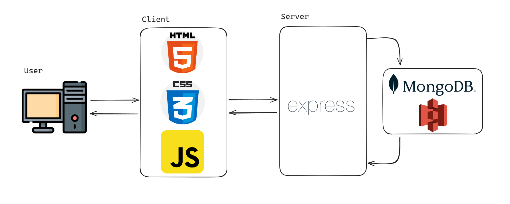

## 🛍️ Memoire : 당신의 기억을 특별하게 해 줄 향수 주문 쇼핑몰

[http://34.64.198.78](http://34.64.198.78)

💐 **Memoire로 초대합니다** 💐

## ✨ 개요(Intro)

**엘리스 SW 엔지니어 트랙 9기** 프로젝트 과제로서,

실제 서비스 운영이 아닌 기능 구현에 초점을 맞춘 데모 웹 어플리케이션입니다.

엘리스 측의 구현 요구사항에 따라, **Express.js**를 기반으로 MPA(Multi Page Application)를 구현하였습니다.

Memoire는 소비자가 다양한 향수를 쉽게 찾고 구매할 수 있는 온라인 플랫폼입니다.

## 🔧 기술 스펙

## **📝** 서비스 기능

## 👥 팀원

| 이름   | 역할   |
| ------ | ------ |
| 유준상 | FE, BE |
| 이지원 | FE, BE |
| 김현빈 | FE, BE |
| 정수연 | FE, BE |
| 정상기 | FE, BE |

## 주요 화면

